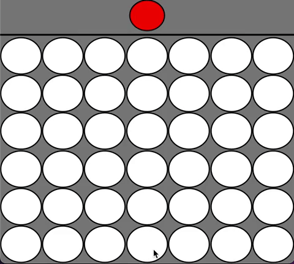

# Connect 4 (커넥트 포) AI

## 룰

Connect 4는 가로 7칸, 세로 6칸인 직사각형 판을 위로 세워 말을 떨어트려, 교대로 하면서 가로, 세로 또는 대각선 4개를 만들면 이기는 게임입니다.

## 인공지능

인공지능은 미니맥스(Minimax) 알고리즘을 사용합니다. 인공지능은 0.5초 안에 수를 둬야 하는 제한이 있어서 모든 경우의 수를 보지 못합니다. 그래서 평가 함수(evaluation function)를 사용해서 말의 위치가 얼마나 좋은지를 측정합니다.

## 실행하는 방법

1. `make` 으로 컴파일.

2. a) `java Main -p1 minimax` 인공지능이 선공.

   b) `java Main -p2 minimax` 인공지능이 후공.

3. `make clean` 으로 생선된 파일 제거.
